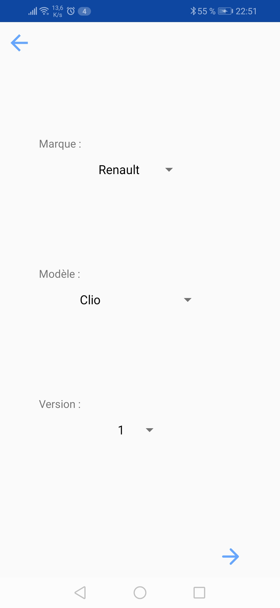

# Projet Application Mobile
Cette application est une application de gestion d'annonces. Cette application est une partie de mon _Projet Scientifique et Technique 4_.

# Présentation

## Contexte 
Nous sommes dans une start-up dans le secteur automobile. Notre objectif est de créer une application mobile de vente de véhicule neuve ou d'occasion.
De ce fait, notre application doit gérer les utilisateurs et ces derniers doivent être capable de créer des annonces et gérer leurs annonces.

La création d'annonces est notre cas d'utilisation qui sera présenté lors de ce projet d'application mobile.

## Prérequis
* Récupérer la branche /Erdane: https://github.com/Mummoc/PST4/tree/Erdane
* Télécharger le fichier sur son mobile android : app-debug.apk

## Caractéristiques

* Gitflow 
* Architecture MVC
* Material design
* Fragment
* Adapter : Recycler view & spinner
* Utilisation appareil photo numérique
* Accès à la galerie d'images
* Bonus : 
  '*Animation de bouton'
  
## Fonctionnalités

Exemple d'une vue au sein d'un fragment, dans laquelle on va entrer quelques informations sur notre voiture
