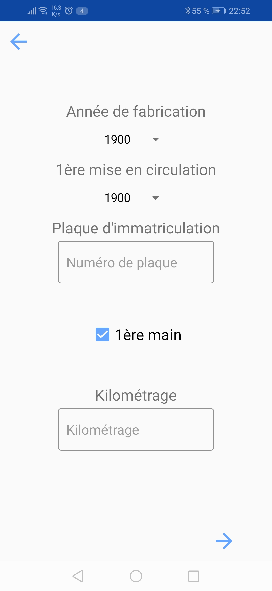
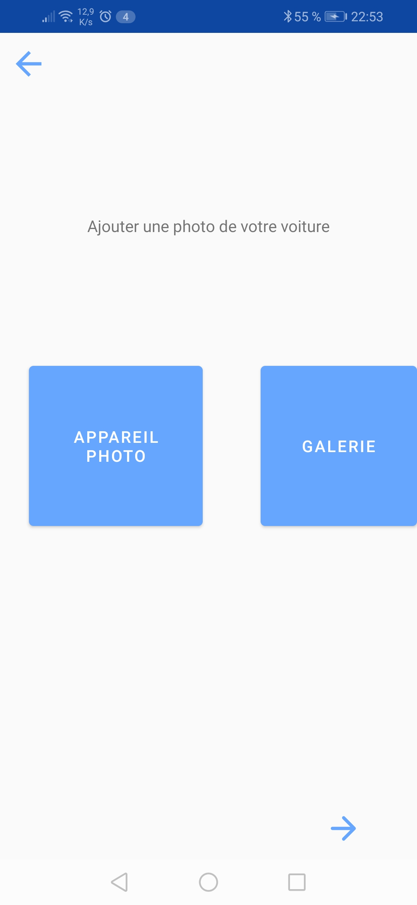
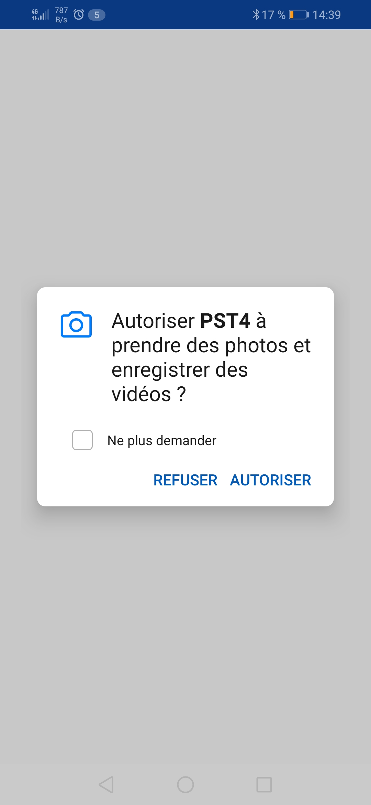
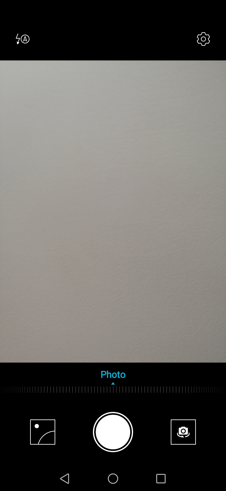
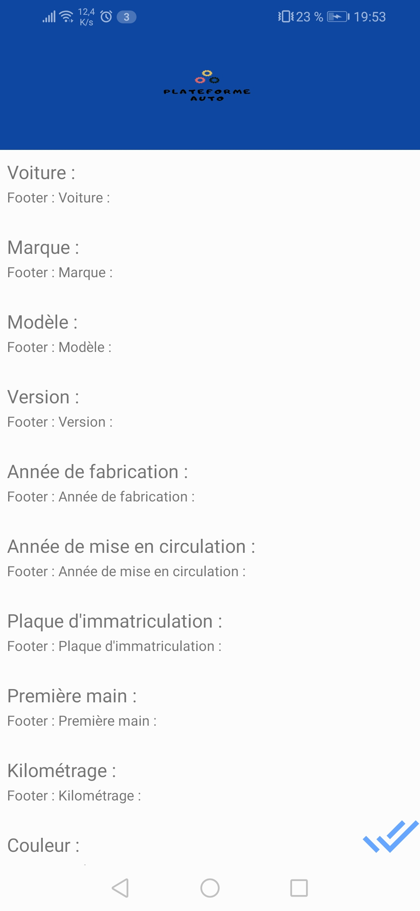

# Projet Application Mobile
Cette application est une application de gestion d'annonces. Cette application est une partie de mon _Projet Scientifique et Technique 4_.

# Présentation

## Contexte 
Nous sommes dans une start-up dans le secteur automobile. Notre objectif est de créer une application mobile de vente de véhicule neuve ou d'occasion.
De ce fait, notre application doit gérer les utilisateurs et ces derniers doivent être capable de créer des annonces et gérer leurs annonces.

La création d'annonces est notre cas d'utilisation qui sera présenté lors de ce projet d'application mobile.

## Prérequis
* Récupérer la branche /Erdane: https://github.com/Mummoc/PST4/tree/Erdane
* Télécharger le fichier sur son mobile android : app-debug.apk

## Caractéristiques

* Gitflow 
* Architecture MVC
* Material design
* Fragment
* Adapter : Recycler view & spinner
* Utilisation appareil photo numérique
* Accès à la galerie d'images
* Bonus : 
  * Animation de bouton
  
## Fonctionnalités

Exemple d'une vue au sein d'un fragment, dans laquelle on va entrer quelques informations sur notre voiture.

> Notez l'utilisation de la librairie de Material Design avec par exemple ces champs de texte.

Après avoir rempli toutes les informations demandées pour votre voiture, il vous sera demandé d'ajouter une photo de votre voiture.

Deux méthodes d'ajout de photo sont proposées :
* Soit une prise de photo,  avec l'appareil photo
* Soit une photo déjà prise, depuis la gallerie

Si vous choisissez d'utiliser la caméra, alors il vous sera demandé une autorisation pour accéder à la caméra

Une fois acceptée, vous pouvez prendre votre photo.

Si vous choisissez de prendre une photo depuis votre galerie, l'applicatio accèdera directement à votre galerie.

Dès que votre image sera choisie ou votre photo sera prise, elle sera ajouter dans une grille.

:warning: Petit bug, si vous ne choisissez pas d'ajouter d'image ou de photo, vous aurez accès à une liste récapitulative de vos données.

> Notez que le bouton suivant s'est transformé en bouton validé. Faite retour, et constater que la transformation inverse s'effectue.
> Dans la collapsing toolbar a été insérer le logo de la startup

